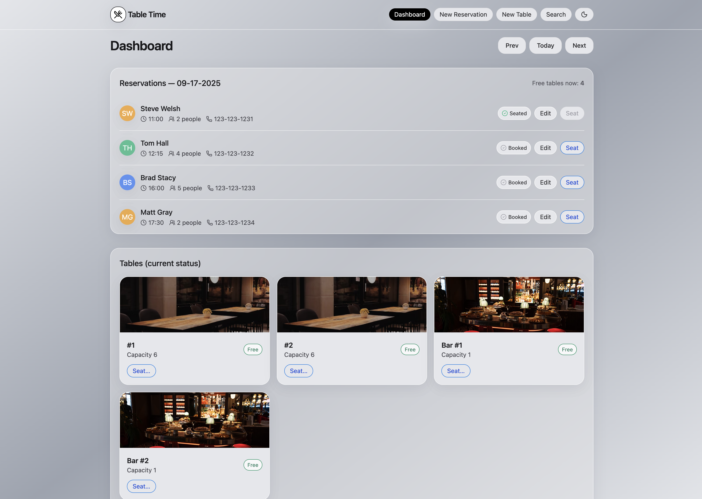
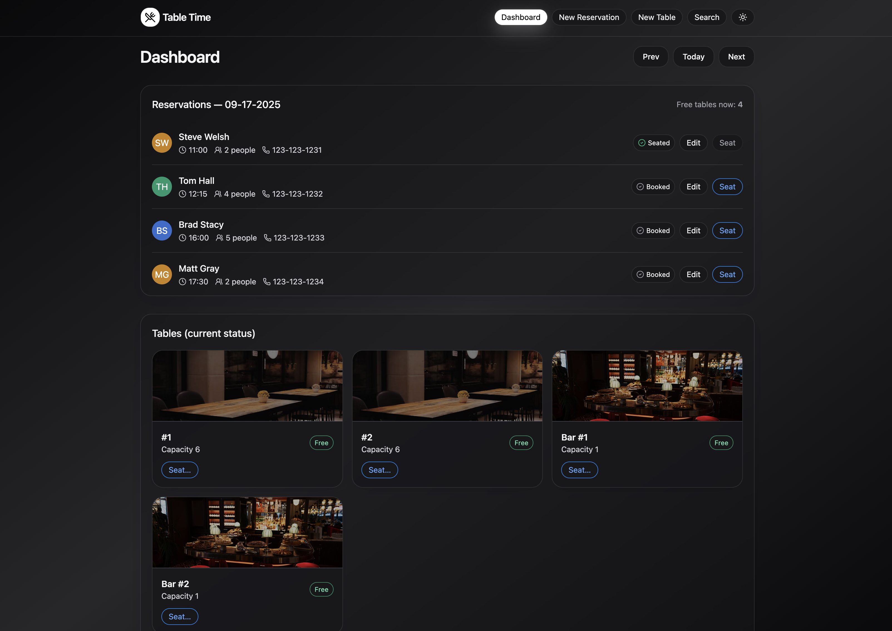
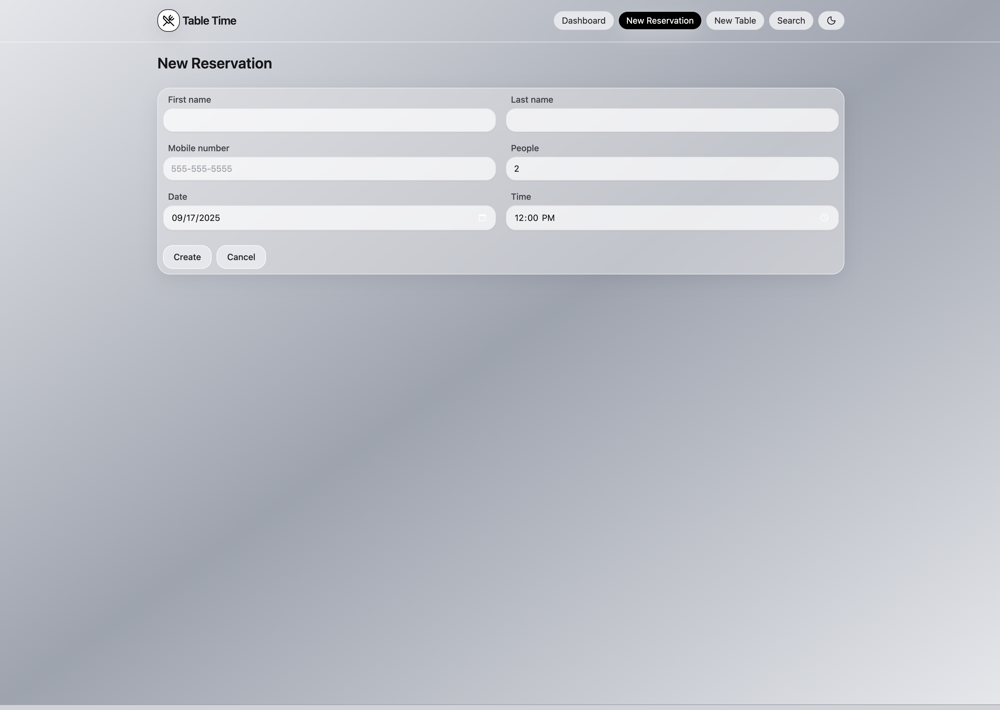
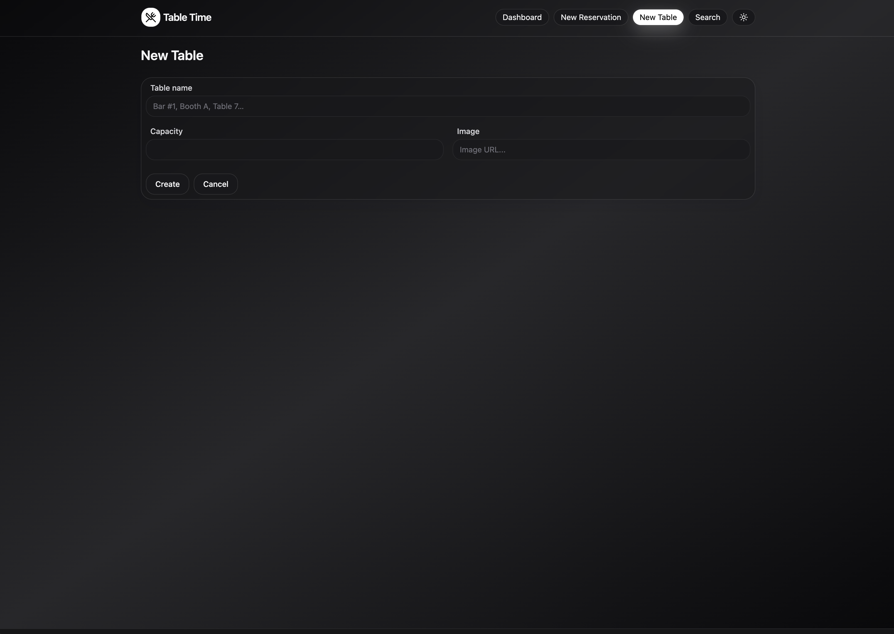

# TableTime 🍽️
A full-stack restaurant reservation management system with modern UI, real-time table assignments, and cloud deployment.



---

## 🚀 Live Demo
- **Frontend:** [table-time-vert.vercel.app](https://table-time-vert.vercel.app)
- **Backend API:** [tabletime-api.fly.dev](https://tabletime-api.fly.dev)

---

## 📖 The Challenge
Restaurant management tools are often:
- Frontend-only demos with no real database.
- Lacking features like seating tables, editing reservations, or preventing conflicts.
- Not deployed — making them impractical to test in real-world scenarios.

I set out to build a **realistic SaaS-style reservation system** with:
- A modern, responsive UI (light & dark mode).
- Real backend with persistent Postgres storage.
- Cloud-deployed frontend & backend so anyone can use it.

---

## 💡 The Solution

### Frontend
- **React + Vite + TypeScript** for a fast, type-safe SPA.
- **TailwindCSS** with full **dark mode** support and glassy gradients.
- **React Query** for caching + real-time UI updates.
- Components: dashboard cards, seating modals, table grid with photos, reservation editor.

### Backend
- **Express.js** REST API with modular routing.
- **Knex.js** migrations for schema + seeds.
- **PostgreSQL** database (Neon cloud hosting).
- Validations for:
  - Restaurant hours (10:30am–9:30pm).
  - Closed on Tuesdays.
  - Table capacity checks.
  - Prevent double-seating.

### Deployment
- **Fly.io** for backend API (Dockerized, SSL, scaling).
- **Vercel** for frontend hosting.
- **Neon Postgres** for database.
- CORS + environment variables for local vs production.

---

## 🛠️ Tech Stack

- **Frontend:** React, Vite, TypeScript, TailwindCSS, React Query, Sonner (toasts)
- **Backend:** Node.js, Express, Knex.js, PostgreSQL
- **DevOps:** Fly.io, Vercel, Docker, Neon (DB hosting)

---

## 📸 Screenshots

### Dashboard (Light & Dark)



### Reservations & Tables



---

## 📚 Lessons Learned
- **CORS in production:** Needed to whitelist both local dev and deployed frontend origins.
- **SPA routing on Vercel:** Fixed refresh 404s using rewrites.
- **Database migrations:** Fly.io doesn’t auto-migrate — must run via `fly ssh console`.
- **Error handling UX:** Unified API error messages across inline alerts + toasts.

---

## 🏃 Running Locally

1. **Clone the repo**
   ```bash
   git clone https://github.com/your-username/tabletime.git
   cd tabletime
   ```

2. **Backend setup**
   ```bash
   cd backend
   cp .env.example .env   # add DATABASE_URL
   npm install
   npm run db:migrate
   npm run db:seed
   npm run start:dev
   ```

   Runs at [http://localhost:5001](http://localhost:5001).

3. **Frontend setup**
   ```bash
   cd frontend
   cp .env.example .env   # set VITE_API_BASE=http://localhost:5001
   npm install
   npm run dev
   ```

   Runs at [http://localhost:5173](http://localhost:5173).

---

## 📌 Roadmap
- [ ] Reservation search filters (by name, phone).
- [ ] Email/SMS confirmations.
- [ ] Auth system for staff login.
- [ ] Table photo uploads (stored via `image_url` column).

